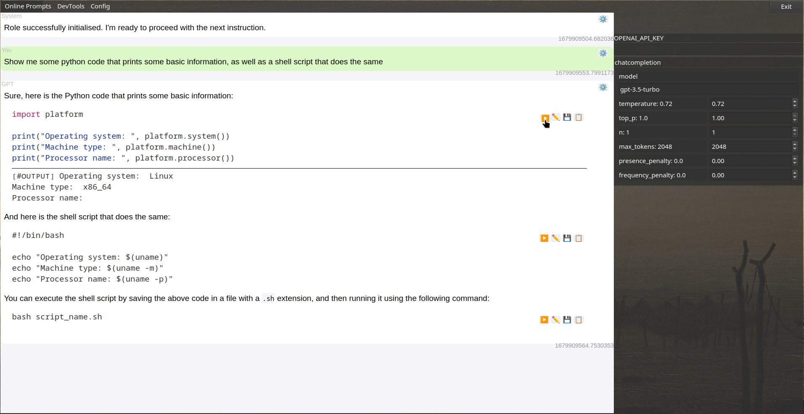

## GPT Roles
Simple PyQT chatbox that connects to a chat session with ChatGPT, along with some extra desktop integration features.

Written as an experiment with Qt and understanding the role of LLMs in virtual assistant applications.




#### Roleplayer
It has a "roleplaying" root prompt that attempts to make implementing more roles into ChatGPT easier.
You can add "roles" to the root prompt, by default there are some roles related to commands and programming.

You can also change the root prompt to something else entirely, there's a list of some prompts that are sourced online, see features.

###### Command Role

Not fully implemented

    - RoleGPT can request web pages or from APIs to answer your questions.
        e.g. get current prices or latest news.
    - Provide basic shell commands that will be automatically be run, to find or list files etc
    - Instructions to format markdown for the programming features

#### App Features

Programming related features:

    - Run shell or python code in markdown blocks directly in the chat interface
    - Edit the markdown blocks in the chat box
    - Copy or save markdown blocks to a file

Additional features:

    - Easily switch or add more "roles"
    - Remove the roleplaying root prompt and set it as you please
    - List roles from jailbreakchat.com and set them as the root prompt

Chat related features:

    - TODO Shows which messages are in the current prompt chain and can be added/removed
    - TODO Show alternate choices and commit to conversation


#### Installing/Running

###### From pip
Install the module and install desktop launcher integration:

`pip install gptroles && ./install.sh`


###### From source with Poetry
```shell
poetry install && poetry run main
```

###### Packaged AppImage/PyInstaller

`TODO`

###### Development installation

Use the `dev.sh` script.

```shell
# This only needs to be run once
./dev.sh build && ./dev.sh sysinstall && ./dev.sh install

# Then you can run with the install and dev environment matching code
./dev.sh run
```